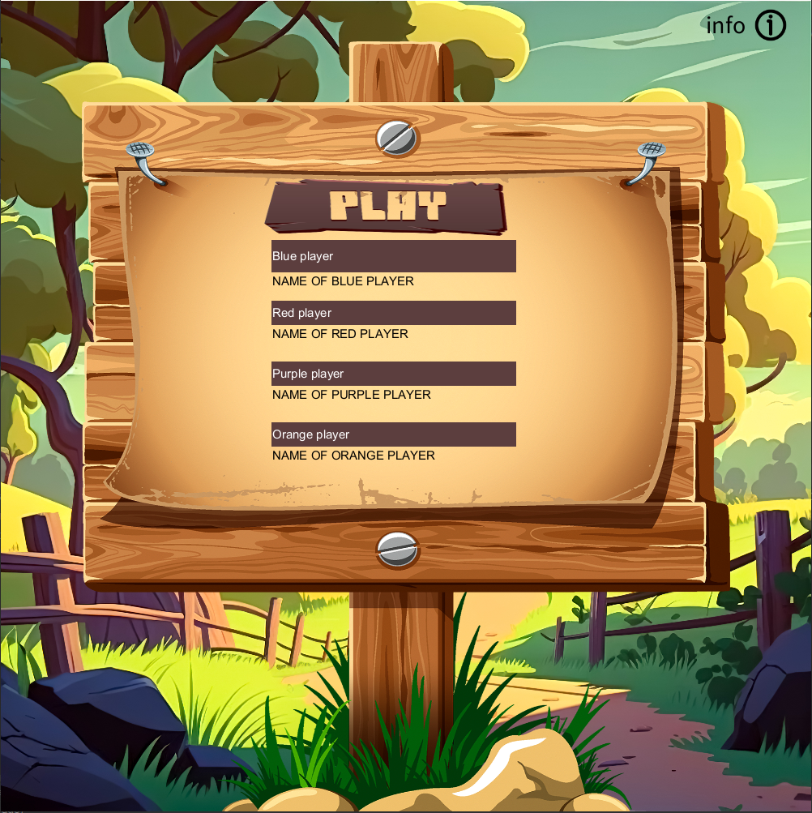
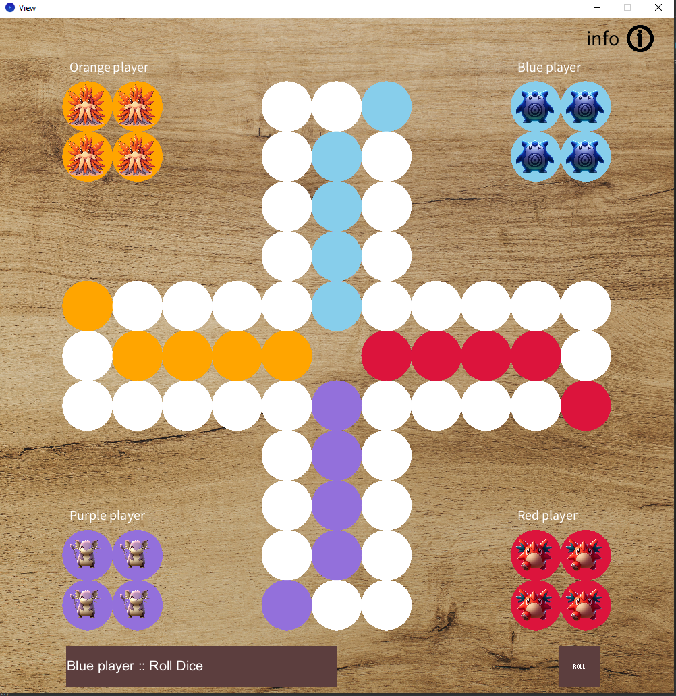
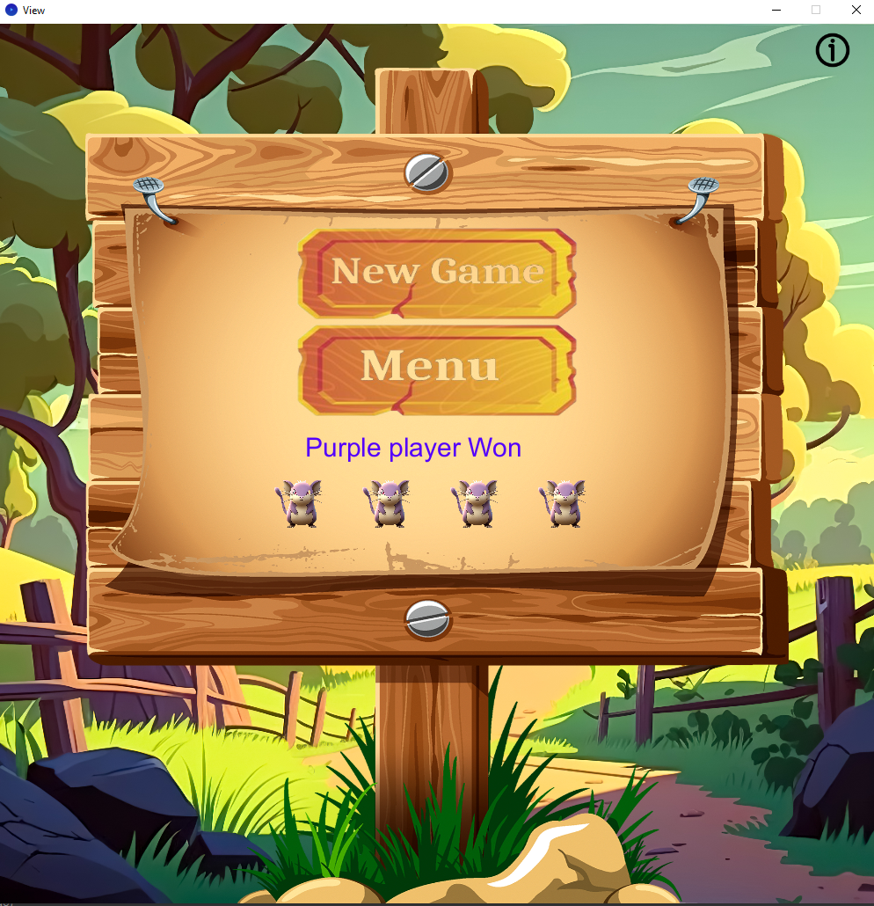
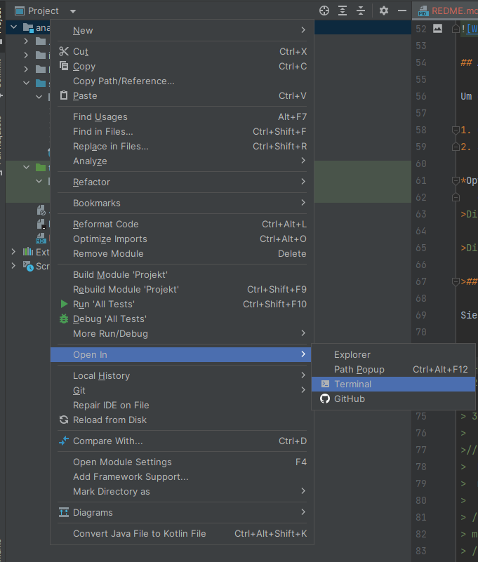

# Mensch Ärgere Dich Nicht

## Beschreibung
Dieses Programm implementiert das Spiel "Mensch Ärgere Dich Nicht" mit Hilfe der Processing-Bibliothek in Java. Es wird von einem MVC (Model-View-Controller)-Architekturmuster angetrieben.
Mensch Ärgere Dich Nicht ist eine digitale Umsetzung des beliebten Brettspiels 
"Mensch Ärgere Dich Nicht". Das Spiel bietet ein unterhaltsames und herausforderndes Spielerlebnis für bis zu vier Spieler. Jeder Spieler hat vier Spielfiguren,
die er sicher in die Endzone bewegen muss, um zu gewinnen. Bei dem normalen Spiel ist es so, dass man zweimal
würfeln kann, wenn man seinen Figure nicht bewegen kann. Hier ist es aber so, dass man nur ein Mal würfeln kann.

 ## Features 
**Vier Spieler:** Spiele mit bis zu vier Freunden oder Computergegnern.

**Würfeln und Bewegen:** Würfle und bewege deine Spielfiguren über das Spielfeld, um sie sicher in die Endzone zu bringen.

*Gewinnen:** Der erste Spieler, der alle seine Spielfiguren in die Endzone bringt, gewinnt das Spiel.

**Gemeinsames Spielerlebnis:** Genieße das Spiel mit Familie und Freunden im lokalen Mehrspielermodus.
## Verwendete Bibliotheken

1. **Processing Core Library:**
    - [Processing Core](https://processing.org/reference/core/)

2. **ControlP5 Library:**
   - [ControlP5](http://www.sojamo.de/libraries/controlP5/)

3. **JUnit 5:**
    - [JUnit 5](https://junit.org/junit5/)

4. **Java Util Library:**
   - [Java Util](https://docs.oracle.com/en/java/javase/17/docs/api/java.base/java/util/package-summary.html)

## Screenshots
Hier sind einige Screenshots des Programms:

**Screenshot 1:** Dies ist der Startbildschirm.  
Oben rechts gibt es einen Button, auf den der Nutzer klicken kann, um Informationen zur Steuerung des Spielers zu erhalten.
 Die Spieler können ihre Namen eingeben.

Wenn man die Eingabetaste drückt, werden die eingegebenen Namen gelöscht, und man muss sie erneut eingeben.
 

Wenn man auf die Schaltfläche "Play" drückt, werden die eingegebenen Namen übernommen und das Spiel gestartet. 



**Screenshot 2:** Hier sieht man wie das Spiel aussieht, wenn man in einem Game ist. 
Der Spieler soll auf den taste Roll drücken, um einen zug zu machen. 



**Screenshot 2:** Win Screen 



## Anleitung zur Ausführung

Um das Programm auszuführen, führen Sie die folgenden Schritte aus:

1. Öffnen der Datei `Main.java`
2. Starten der `main()` Methode

*Optional:* Zum Änderen der Feld größe muss in der `main()` methode
   die Variablen ` GAME_WIDTH` und ` GAME_HEIGHT ` angepasst werden.
>Die empfolene `Width`  beträgt `1000`

>Die empfolene `Heigth`  beträgt `1000`

## Beispiel in der JShell

Sie können das Modell in der JShell testen. Hier ist ein einfaches Beispiel:

> 1. laden sie das Projekt von [Git-Projekt](https://github.com/anasaji22/MenschEargerDichNicht) herunter
> 2. Öffne das Projekt Ordner in der Jshell
>  
> 2. Öffne die jshell mit dem Befehl : `
>    jshell --class-path .\out\production\Projekt\ 
> 3.  import MenschEargereDichNicht.model.*;
>```java
>// Erstellen Sie eine Instanz des Modells
>  Model m = new Model(1000,1000)
>  m.newGame() // um ein neues Spiel zu starten.
>.   .   .   .   .   .   .   .   .   .   .   .   .
>.   O   O   .   .   #   #   #   .   .   B   B   .
>.   O   O   .   .   #   #   #   .   .   B   B   .
>.   .   .   .   .   #   #   #   .   .   .   .   .
>.   .   .   .   .   #   #   #   .   .   .   .   .
>.   #   #   #   #   #   #   #   #   #   #   #   .
>.   #   #   #   #   #   .   #   #   #   #   #   .
>.   #   #   #   #   #   #   #   #   #   #   #   .
>.   .   .   .   .   #   #   #   .   .   .   .   .
>.   .   .   .   .   #   #   #   .   .   .   .   .
>.   P   P   .   .   #   #   #   .   .   R   R   .
>.   P   P   .   .   #   #   #   .   .   R   R   .
>.   .   .   .   .   .   .   .   .   .   .   .   .
>
> Box b = m.getBoxMap().get(m.getCurrentPlayerBoard()[0])
> // Damit man den Spieler von seinem ersten zbewegt.
> m.movePokemon(6,b, m.getCurrentPlayer().getListOfPokemons().get(0)) 
> //So sieht die Ausgabe nach der Bewegung der Spieler
>.   .   .   .   .   .   .   .   .   .   .   .   .  
>.   O   O   .   .   #   #   B   .   .   #   B   .
>.   O   O   .   .   #   #   #   .   .   B   B   .  
>.   .   .   .   .   #   #   #   .   .   .   .   .
>.   .   .   .   .   #   #   #   .   .   .   .   .
>.   #   #   #   #   #   #   #   #   #   #   #   .
>.   #   #   #   #   #   .   #   #   #   #   #   .
>.   #   #   #   #   #   #   #   #   #   #   #   .
>.   .   .   .   .   #   #   #   .   .   .   .   .
>.   .   .   .   .   #   #   #   .   .   .   .   .
>.   P   P   .   .   #   #   #   .   .   R   R   .
>.   P   P   .   .   #   #   #   .   .   R   R   .
>.   .   .   .   .   .   .   .   .   .   .   .   .
## Quellen der Fotos

Die Fotos in diesem Projekt stammen aus den folgenden Quellen:

- Die meisten Fotos wurden mithilfe von [KI](https://www.bing.com/chat) generiert.
